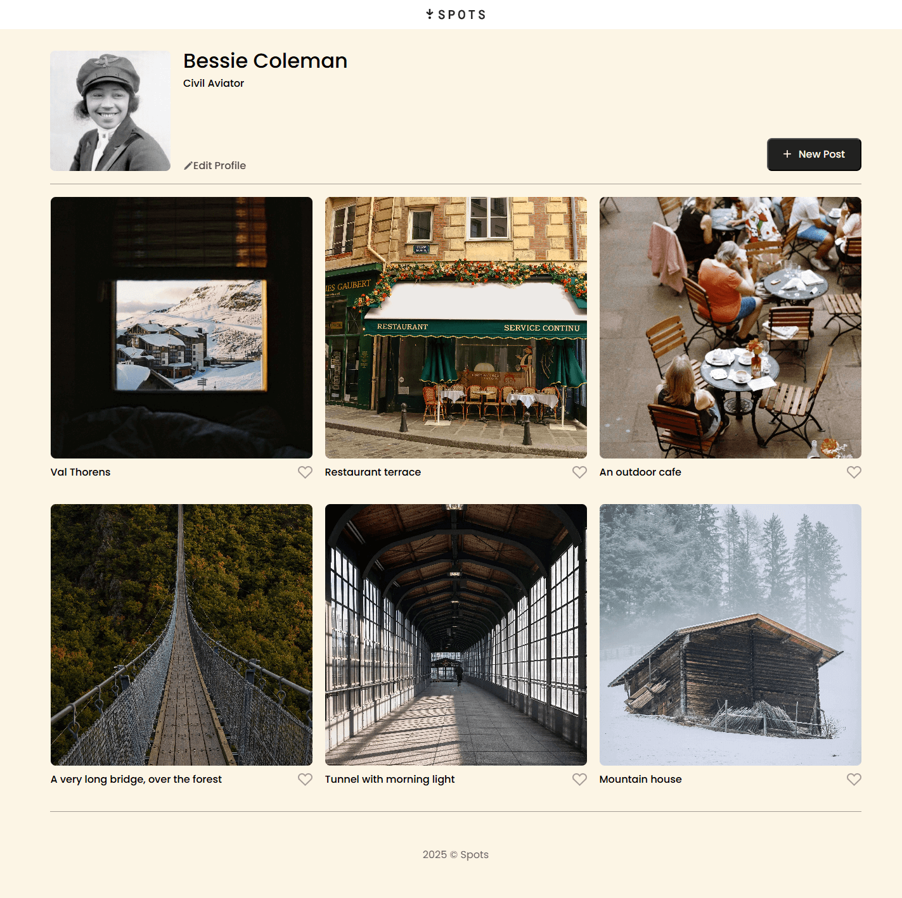
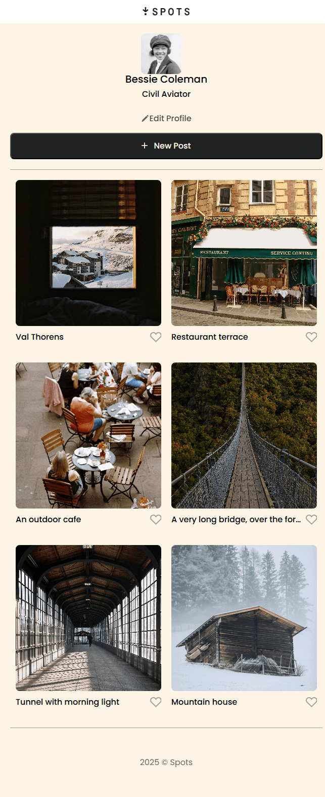

# Project 3: Spots

Image sharing site with a responsive design.

## Description

This project has a responsive design that starts with max-width of 1280px down to a max-width of 288px. it is meant to work with both desktops and mobile. under the header there are six images that at screen width of 1345px and larger line up with 3 columns and 2 rows. At around the screen with 1344px the images drop to 2 columns 3 rows. Then finally at a screen width of 897px the 6 images drop into a single column.

![small] (images/small_project_img.png)

## Deployment

This webpage is deployed on github pages.

- [Deployment Link] (https://cedwards2527.github.io/se_project_spots/)
- [Deployment Link] (https://www.loom.com/share/13dbedd22a2e4a5385e4b9527c1377f2?sid=bf08b585-ce8b-42a0-a428-8af3961d9b8f)
